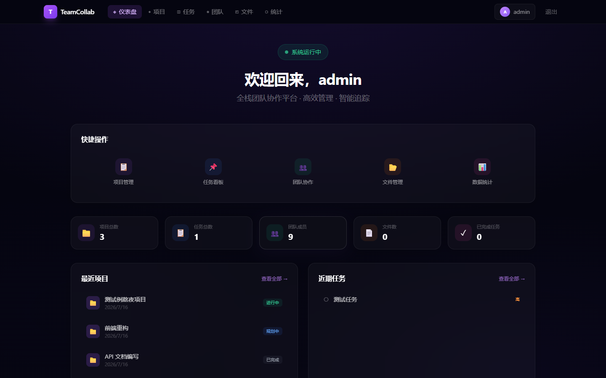
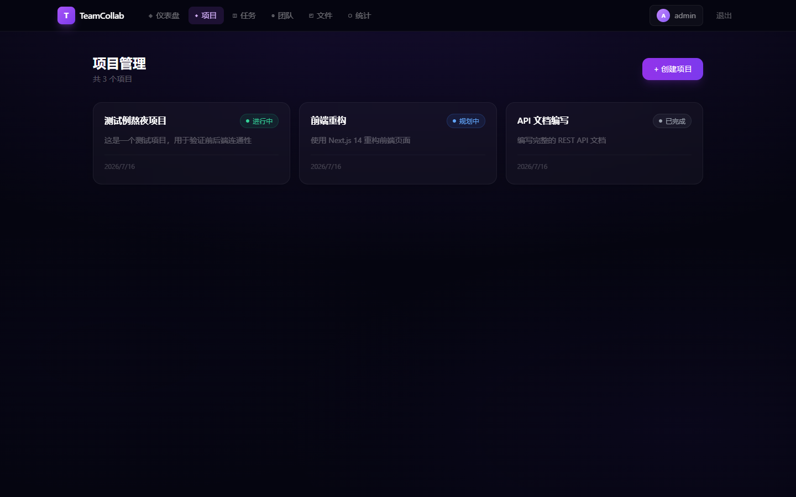
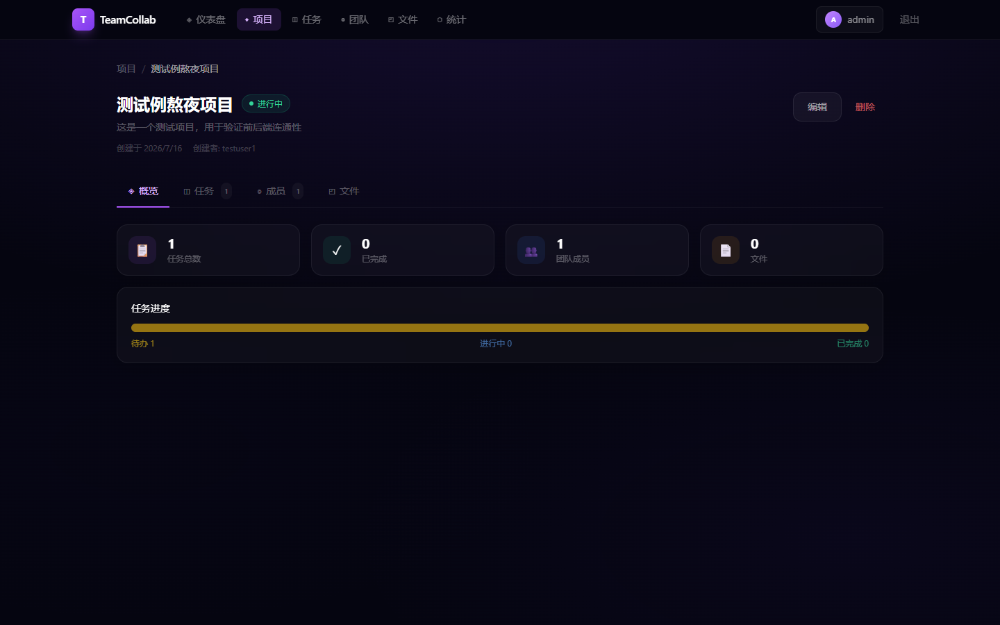
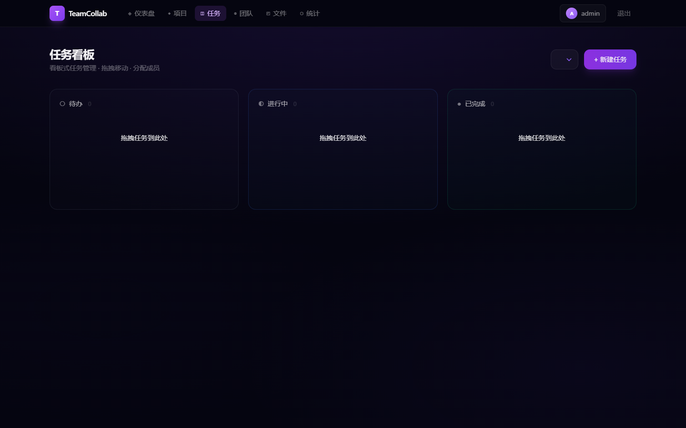
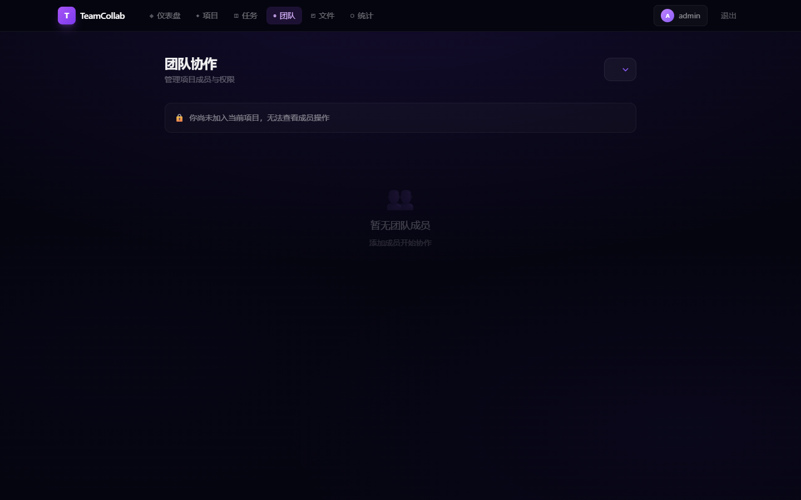
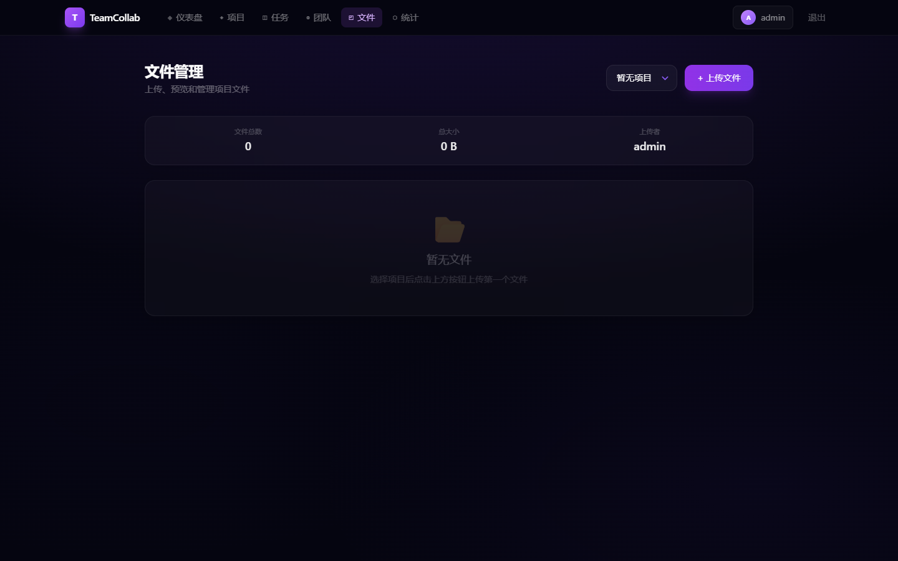
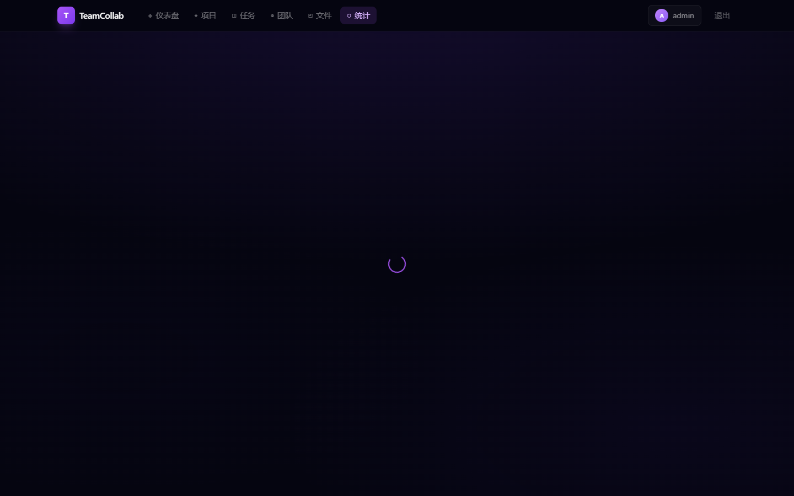

# 团队协作平台 (Team Collab Platform)

> **一个基于 Next.js 14 + Flask 的全栈团队协作管理系统**，支持项目管理、任务看板、团队协作、文件共享和数据统计。前后端分离架构，已完成 Railway 生产部署。

## 在线演示

| 环境 | 地址 | 状态 |
|------|------|------|
| 前端 | [https://powerful-growth-production-77f2.up.railway.app](https://powerful-growth-production-77f2.up.railway.app) | ✅ 在线 |
| 后端 API | [https://powerful-growth-production-77f2.up.railway.app](https://powerful-growth-production-77f2.up.railway.app) | ✅ 在线 |

## 技术栈

| 层级 | 技术 | 版本 | 说明 |
|------|------|------|------|
| 前端框架 | Next.js 14 (App Router) | 14.2.35 | React 18 + TypeScript 5 |
| 样式方案 | Tailwind CSS | 3.4.1 | 暗色主题 + 玻璃态设计 |
| 状态管理 | React Context | - | AuthContext + 自定义 Hooks |
| 主题切换 | next-themes | 0.4.6 | 亮色/暗色一键切换 |
| 后端框架 | Flask | 3.0.3 | Python RESTful API |
| ORM | SQLAlchemy | 2.0.35 | 数据库操作 |
| 数据库 | SQLite | - | 轻量级关系型数据库 |
| 认证 | Flask-JWT-Extended | 4.6.0 | Access Token(1h) + Refresh Token(30d) |
| 密码加密 | bcrypt | 4.2.0 | 密码哈希存储 |
| 跨域 | Flask-CORS | 5.0.0 | 支持多域名白名单 |
| 部署 | Railway | - | 前后端统一部署 |
| WSGI | Gunicorn | 22.0.0 | 生产级 Python WSGI 服务器 |

## 功能模块

### 1. 用户认证
- 注册 / 登录 / 自动登录
- JWT Token 认证，24小时过期
- 路由保护中间件

### 2. 仪表盘
- 快捷操作入口（项目管理、任务看板、团队协作、文件管理、数据统计）
- 实时统计数据（项目数、任务数、成员数、文件数）
- 最近项目列表
- 近期任务列表

### 3. 项目管理
- 创建 / 编辑 / 删除项目
- 项目状态管理（规划中 / 进行中 / 已完成 / 已归档）
- **项目详情页**（4个Tab）：
  - 概览：项目基本信息 + 统计数据
  - 任务：该项目下的任务看板
  - 成员：添加/移除成员，角色管理（管理员/成员/观察者）
  - 文件：上传/下载/删除文件

### 4. 任务看板
- 三列看板：待办 → 进行中 → 已完成
- 创建任务：标题、描述、优先级、指派成员
- 拖拽移动任务状态（或点击按钮）
- 删除任务
- 按项目筛选

### 5. 团队协作
- 邀请成员加入项目
- 角色管理：管理员 / 成员 / 观察者
- 移除成员
- 按项目筛选

### 6. 文件管理
- 文件上传（支持所有格式）
- 文件列表（名称、大小、上传者、时间）
- 在线预览 / 下载
- 删除文件
- 按项目筛选

### 7. 数据统计
- 项目概览统计
- 任务分布（按状态）
- 文件统计

### 8. 设计系统
- 暗色主题 + 玻璃态设计
- 统一动画系统（淡入、滑入、骨架屏）
- 响应式布局（桌面端 + 移动端）
- Toast 通知系统
- 空状态提示

## 项目结构

```
team-collab-platform/
├── backend/                    # Flask 后端
│   ├── app.py                  # 主入口（6个模型 + 25个API路由）
│   ├── app/                    # 模块化后端（备选架构）
│   │   ├── __init__.py         # 应用工厂 + CORS配置
│   │   ├── extensions.py       # 数据库/JWT扩展
│   │   ├── models/             # 数据模型（User, Project）
│   │   └── routes/             # 路由蓝图（auth, projects）
│   ├── requirements.txt        # Python 依赖
│   ├── Procfile                # Railway 部署配置
│   ├── runtime.txt             # Python 版本声明
│   ├── data.db                 # SQLite 数据库（自动生成）
│   └── uploads/                # 文件上传目录
├── src/                        # Next.js 前端
│   ├── app/                    # App Router 页面（10个页面）
│   │   ├── page.tsx            # 仪表盘首页
│   │   ├── layout.tsx          # 根布局（ThemeProvider）
│   │   ├── client-layout.tsx   # 客户端布局（AuthProvider + Navbar）
│   │   ├── globals.css         # 全局样式（12KB设计系统）
│   │   ├── login/page.tsx      # 登录页
│   │   ├── register/page.tsx   # 注册页
│   │   ├── projects/           # 项目列表 + [id] 详情页（4 Tab）
│   │   ├── tasks/page.tsx      # 任务看板（三列拖拽）
│   │   ├── team/page.tsx       # 团队协作
│   │   ├── files/page.tsx      # 文件管理
│   │   ├── stats/page.tsx      # 数据统计
│   │   └── inbox/page.tsx      # 收件箱（邀请管理）
│   ├── components/
│   │   └── Navbar.tsx          # 导航栏（响应式 + 通知徽章）
│   ├── lib/
│   │   ├── api.ts              # API 封装 + 完整类型定义（360行）
│   │   ├── auth.ts             # 认证工具函数
│   │   └── auth-context.tsx    # React 认证上下文 Provider
│   └── middleware.ts           # Next.js 路由保护中间件
├── docs/                       # 项目文档
│   ├── API接口文档.md          # 25个API端点完整文档
│   ├── 数据库设计文档.md        # ER图 + 6张表结构
│   ├── 用户操作手册.md          # 完整操作指南
│   ├── 项目提交清单.md          # 提交材料确认
│   └── screenshots/            # 9张界面截图
├── start.bat                   # Windows 一键启动
├── start.sh                    # Linux/macOS 一键启动
├── .env.example                # 环境变量模板
├── tailwind.config.ts          # Tailwind 配置
├── vercel.json                 # Vercel 部署配置
├── next.config.mjs             # Next.js 配置
├── tsconfig.json               # TypeScript 配置
└── package.json                # Node 依赖
```

## 快速开始

### 环境要求

- **Node.js** >= 18
- **Python** >= 3.10
- **npm** >= 9

### 一键启动（推荐）

**Windows：**
```bash
双击 start.bat
```

**Linux / macOS：**
```bash
chmod +x start.sh
./start.sh
```

### 手动启动

#### 1. 启动后端

```bash
cd backend
pip install -r requirements.txt
python app.py
```
后端运行在 `http://localhost:5000`

#### 2. 启动前端

```bash
npm install
npm run dev
```
前端运行在 `http://localhost:3000`

### 测试账号

系统首次启动会自动创建测试数据，可使用以下账号登录：

| 用户名 | 密码 | 示例项目角色 | 说明 |
|--------|------|--------------|------|
| testuser1 | 123456 | 项目拥有者 | 创建者，拥有最高权限 |
| testuser2 | 123456 | 项目成员 | 普通成员，可查看/参与任务 |
| admin | admin123 | 项目管理员 | 可添加/移除成员、修改角色 |

> 推荐使用 `admin` 登录体验完整的团队协作管理功能。

## 环境变量

复制 `.env.example` 为 `.env.local`：

```bash
cp .env.example .env.local
```

| 变量名 | 说明 | 默认值 |
|--------|------|--------|
| `NEXT_PUBLIC_API_URL` | 后端 API 地址 | `http://localhost:5000` |

## API 接口

| 方法 | 路径 | 说明 |
|------|------|------|
| POST | `/api/auth/register` | 注册 |
| POST | `/api/auth/login` | 登录 |
| GET | `/api/auth/me` | 获取当前用户 |
| POST | `/api/auth/refresh` | 刷新 Token |
| GET | `/api/projects` | 获取项目列表 |
| POST | `/api/projects` | 创建项目 |
| PUT | `/api/projects/<id>` | 更新项目 |
| DELETE | `/api/projects/<id>` | 删除项目 |
| GET | `/api/projects/<id>/tasks` | 获取项目任务 |
| POST | `/api/projects/<id>/tasks` | 创建任务 |
| PUT | `/api/tasks/<id>` | 更新任务 |
| DELETE | `/api/tasks/<id>` | 删除任务 |
| GET | `/api/projects/<id>/members` | 获取项目成员 |
| POST | `/api/projects/<id>/members` | 添加成员 |
| PUT | `/api/members/<id>` | 更新成员角色 |
| DELETE | `/api/members/<id>` | 移除成员 |
| GET | `/api/projects/<id>/files` | 获取文件列表 |
| POST | `/api/projects/<id>/files` | 上传文件 |
| GET | `/api/files/<id>/download` | 下载文件 |
| DELETE | `/api/files/<id>` | 删除文件 |
| GET | `/api/stats` | 获取统计数据 |
| GET | `/api/users` | 获取用户列表 |

## 安全特性

- JWT Token 认证 + 自动刷新
- 密码哈希存储（werkzeug）
- 路由保护中间件
- API 速率限制（登录 10次/分钟，注册 5次/分钟）
- 文件上传类型白名单 + 大小限制（50MB）
- 文件名安全过滤，防止路径遍历攻击
- 生产环境密钥通过环境变量配置，不硬编码
- Debug 模式由 `FLASK_DEBUG` 环境变量控制
- CORS 跨域支持环境变量配置

## 部署指南

### 当前部署架构

```
用户浏览器 → Railway (Next.js 前端 + Flask 后端)
                    ↓
              SQLite 数据库 + 本地文件存储
```

| 组件 | 平台 | 地址 |
|------|------|------|
| 前端 + 后端 | Railway | `https://powerful-growth-production-77f2.up.railway.app` |

### 后端部署（Railway）

1. 访问 [railway.app](https://railway.app)，导入 GitHub 仓库
2. 设置 **Root Directory = `backend`**
3. 添加环境变量：
   ```
   SECRET_KEY=随机生成的高强度密钥
   JWT_SECRET_KEY=随机生成的高强度密钥
   FLASK_DEBUG=false
   CORS_ORIGINS=https://powerful-growth-production-77f2.up.railway.app,http://localhost:3000
   ```
4. 启动命令：`gunicorn app:app --bind 0.0.0.0:$PORT`
5. 部署成功后，将后端地址填入前端的 `NEXT_PUBLIC_API_URL`

### 生成安全密钥

```bash
python -c "import secrets; print(secrets.token_hex(32))"
```

## 界面预览

| 仪表盘 | 项目列表 | 项目详情 |
|--------|---------|----------|
|  |  |  |

| 任务看板 | 团队协作 | 文件管理 | 数据统计 |
|---------|---------|---------|---------|
|  |  |  |  |

> 更多截图见 `docs/screenshots/` 目录

## 项目文档

| 文档 | 说明 |
|------|------|
| [用户操作手册](docs/用户操作手册.md) | 完整操作指南，覆盖所有功能模块 |
| [数据库设计文档](docs/数据库设计文档.md) | ER 图、5张表结构、字段说明、索引设计 |
| [API 接口文档](docs/API接口文档.md) | 20+ 接口完整文档，含请求/响应示例 |
| [项目提交清单](docs/项目提交清单.md) | 49项提交材料逐一确认 |

## 提交指南

```bash
git add .
git commit -m "feat: 团队协作平台 V2.0 - 完整功能升级"
git push origin main
```

### 提交内容

- ✅ 全部源代码（前端 20 个文件 + 后端 8 个文件）
- ✅ 项目文档（README + 操作手册 + 数据库设计 + API 文档 + 提交清单）
- ✅ 界面截图（9 张，覆盖所有功能页面）
- ✅ 配置文件（package.json、requirements.txt、.env.example 等）
- ✅ 一键启动脚本（Windows + Linux/macOS）

### 不会提交的内容（.gitignore 已排除）

- `node_modules/`、`.next/` → 执行 `npm install` 重建
- `backend/data.db` → 首次运行自动创建（含测试数据）
- `backend/uploads/*` → 用户上传文件目录
- `.env` / `.env.local` → 本地环境变量
- `.codebuddy/` → IDE 工具数据
