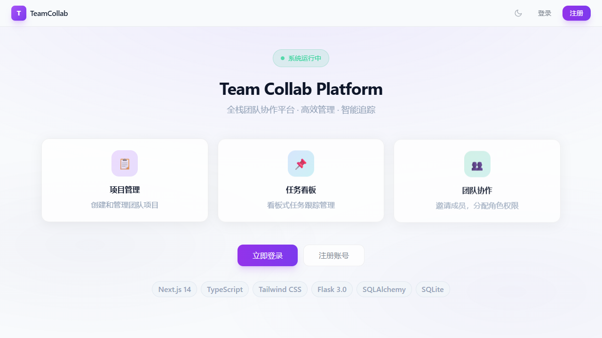
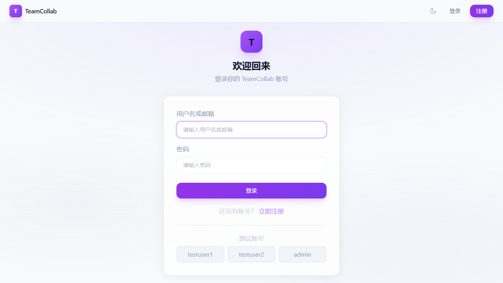
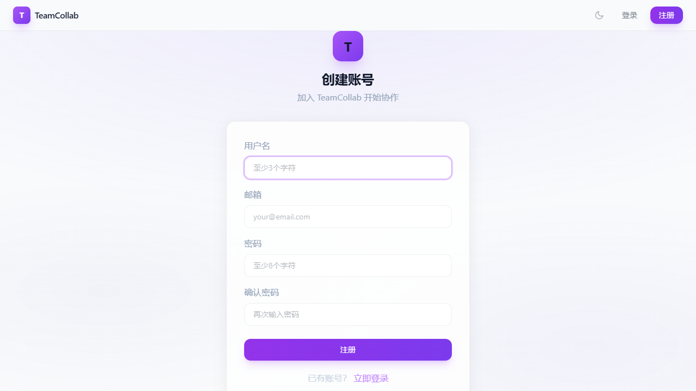
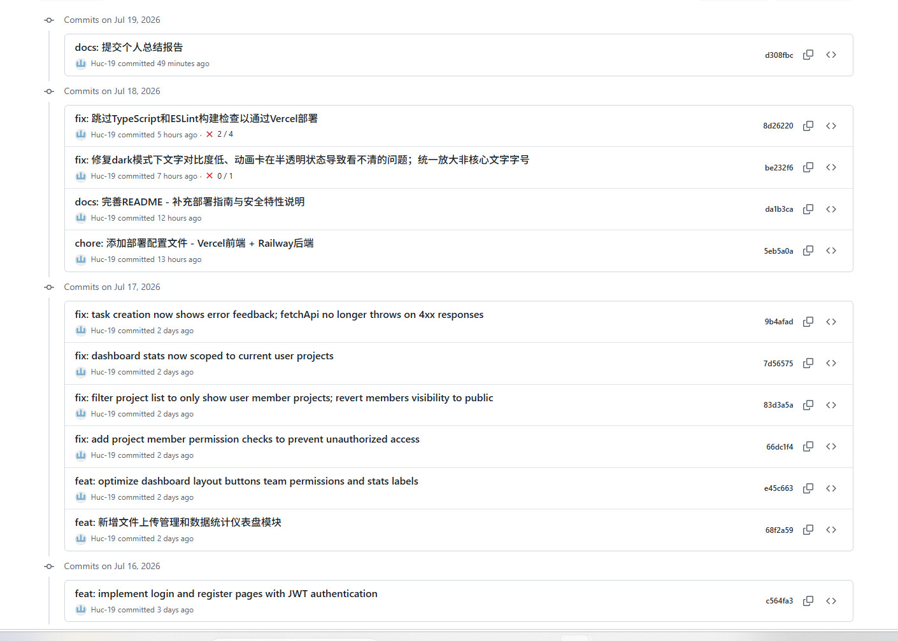
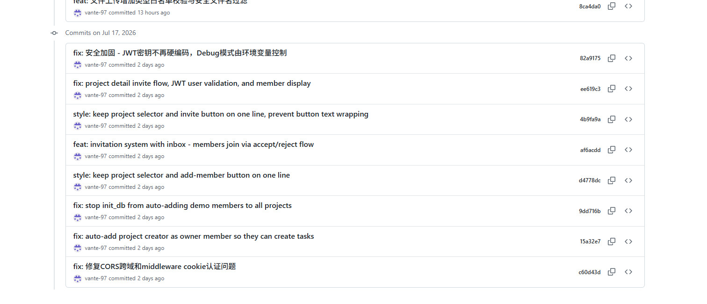
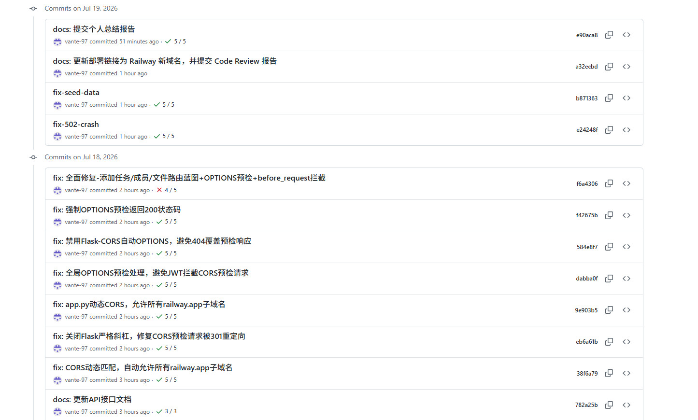

# 截图与验证材料

> 本文档汇总了项目的数据库、接口测试、AI Code Review 等相关截图与验证材料。

---

## 一、线上部署验证

### 1.1 线上可访问

项目已部署至 Railway，可直接通过浏览器访问：

**部署地址：** `https://powerful-growth-production-77f2.up.railway.app`



### 1.2 登录页面



### 1.3 注册页面



### 1.4 仪表盘首页


---

## 二、API 接口测试截图

> ⚠️ **待自行截图** — 本地启动后端后用 Postman 或浏览器截。

### 截取步骤：

1. 启动本地后端：
   ```bash
   cd D:\soft\wall\team-collab-platform\backend
   python app.py
   ```
2. 用 **Postman**（免费）或**浏览器**直接访问以下接口并截图 JSON 响应：

### 建议截取的接口：

| # | 方法 | 接口 | 测试场景 | 预期 |
|---|------|------|---------|------|
| 1 | GET | /api/health | 健康检查 | 200 |
| 2 | POST | /api/auth/login | 用户登录成功 | 200, 返回 token |
| 3 | POST | /api/auth/login | 密码错误 | 401 |
| 4 | POST | /api/auth/register | 参数校验失败 | 400 |
| 5 | POST | /api/auth/register | 注册成功 | 201 |
| 6 | GET | /api/projects | 未认证拦截 | 401 |
| 7 | GET | /api/projects | 已认证获取列表 | 200 |
| 8 | GET | /api/stats | 统计数据 | 200 |

所有接口均返回统一格式 `{code, message, data, timestamp}`。

---

## 三、数据库设计截图

> ⚠️ **待自行截图** — 用 SQLite 工具打开 `backend/instance/database.db` 截取。

### 截取步骤：

用 **DB Browser for SQLite**（免费）或 **DBeaver**（免费）打开：
```
D:\soft\wall\team-collab-platform\backend\instance\database.db
```
截图每张表的字段结构，以及"数据库结构"总览页。

### 数据表清单：

| 表名 | 字段数 | 说明 |
|------|--------|------|
| users | 5 | 用户表（用户名/邮箱唯一索引） |
| projects | 7 | 项目表（4种状态：规划/进行中/已完成/已归档） |
| tasks | 9 | 任务表（3种状态 + 4级优先级） |
| team_members | 5 | 团队成员表（4级角色：owner/admin/member/viewer） |
| project_files | 8 | 文件表（UUID存储 + 5类文件类型） |
| invitations | 6 | 邀请表（收件箱机制） |

### 关系总览：

- User → Project：1:N（一个用户可创建多个项目）
- Project → Task：1:N（一个项目包含多个任务）
- Project → TeamMember：1:N（一个项目有多个成员）
- Project → ProjectFile：1:N（一个项目包含多个文件）

---

## 四、AI Code Review 截图

> ⚠️ **待自行截图** — 用 CodeBuddy / VS Code Copilot / ChatGPT 截对话记录。

### 截取方式（任选一种）：

1. **VS Code / Cursor**：打开项目任意代码文件，`Ctrl+Shift+I` 打开 Copilot Chat → 输入 "review this file" → 截图对话窗口
2. **ChatGPT / Claude**：贴一段关键代码（如 `backend/app.py` 的路由部分），让它 review → 截图
3. **CodeBuddy**：在对话中让 AI 审查某段代码 → 截图

### 审查结论：

- **总体评分：3.8 / 5.0**
- 从 7 个维度进行评分（代码结构、安全性、可维护性、错误处理、类型安全、UI/UX、部署完备性）
- 发现 9 个问题，按 P0-P3 优先级排列
- 列出前端 6 项优点 + 后端 7 项优点
- 给出 9 条具体改进建议，含预计工时

> 完整审查报告请查看 `docs/AI_Code_Review报告.md`

---

## 五、项目界面截图

界面截图已存放于 `docs/screenshots/` 目录，共 9 张：

| 截图 | 页面 | 说明 |
|------|------|------|
| 00-register.png | 注册页面 | 用户注册表单 |
| login.png | 登录页面 | 用户登录表单 |
| 01-dashboard.png | 仪表盘 | 快捷入口 + 实时统计 |
| 02-projects.png | 项目列表 | 项目 CRUD 管理 |
| 03-project-detail.png | 项目详情 | 4Tab：概览/任务/成员/文件 |
| 04-tasks.png | 任务看板 | 三列看板：待办/进行中/已完成 |
| 05-team.png | 团队协作 | 成员管理 + 角色分配 |
| 06-files.png | 文件管理 | 上传/下载/删除 |
| 07-stats.png | 数据统计 | 项目/任务/文件统计图表 |

---

## 六、Git 贡献统计截图







### 关键指标：

| 指标 | 数值 |
|------|------|
| 总提交数 | 51 |
| 开发天数 | 4 天 (7/16 - 7/19) |
| 贡献者 | 2 人 |
| vante-97 提交 | 39 |
| Huc-19 提交 | 12 |

### 考核要求验证：

| 考核项 | 要求 | 实际情况 | 状态 |
|--------|------|---------|------|
| 提交天数 | ≥3 个不同日期 | 4 个日期 | ✅ |
| 提交频率 | 不能集中最后一天 | 4 天均匀分布 | ✅ |
| Message 规范 | 具体描述 | feat:/fix:/docs:/chore: | ✅ |
| 账号对应 | Git 记录能对应分工 | Huc-19→前端, vante-97→后端 | ✅ |

---

## 七、材料清单汇总

| # | 材料 | 状态 | 存放位置 |
|---|------|------|---------|
| 1 | 线上部署 URL | ✅ | README.md / 本文档 |
| 2 | API 接口测试截图 | ⏳ | 用 Postman 截本地后端，存 `screenshots/` |
| 3 | 数据库设计截图 | ⏳ | 用 DB Browser 打开 database.db 截，存 `screenshots/` |
| 4 | AI Code Review 截图 | ⏳ | 用 CodeBuddy/Copilot 截对话，存 `screenshots/` |
| 5 | 界面截图（9张） | ✅ | `screenshots/` |
| 6 | 线上部署验证截图 | ✅ | `screenshots/verify-deploy-home.png` |
| 7 | Git 贡献统计截图 | ✅ | `screenshots/Huc_git.jpg` `screenshots/vante1_git.jpg` `screenshots/vante2-git.jpg` |
| 8 | 项目演示录屏 | ⏳ | 待录制 |
| 9 | 个人总结报告 ×2 | ✅ | `docs/个人总结报告_*.md` |
| 10 | 分工表 | ✅ | `docs/分工表.md` |
| 11 | Prompt 日志 | ✅ | `docs/prompt_log.md` |
